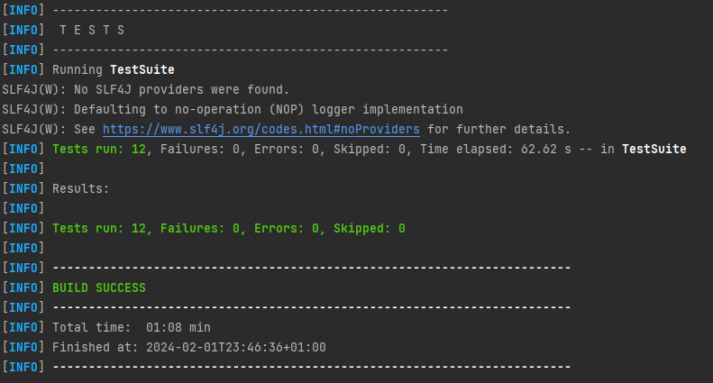

## Kupujem Prodajem - Selenium Test Automation

### Requirements

Before running the tests, ensure you have the following dependencies installed:

- Java Development Kit (JDK)
- Maven
- TestNG
- Chrome WebDriver

For running testng file from command line use command: `mvn clean test -Dsurefire.suiteXmlFiles=testng.xml`

